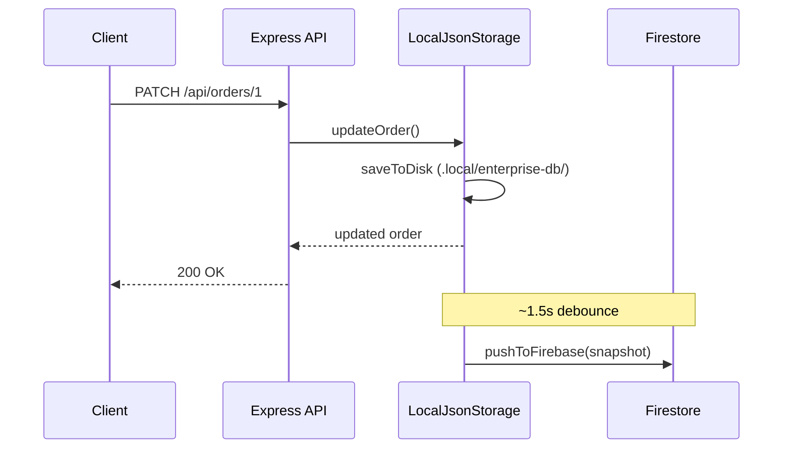

# Architecture

## Overview

SproutDrive is a full-stack TypeScript app:

| Layer | Technology |
|-------|------------|
| Frontend | React 18, Vite, TanStack Query, shadcn/ui |
| Backend | Express, Passport (local / Replit auth) |
| Shared | Zod schemas, business config (`shared/businessConfig.ts`) |
| Storage | Local JSON + Firebase Firestore (enterprise default) |

---

## Storage providers

Selected at startup in `server/storageFactory.ts`:

| Provider | Env | Use case |
|----------|-----|----------|
| **firebase+local** | `FIREBASE_PROJECT_ID` + credentials | Production / enterprise |
| **local-json** | Default (no Firebase) | Local dev without cloud |
| **postgres** | `STORAGE_PROVIDER=postgres` + `DATABASE_URL` | Legacy Replit/Neon |
| **memory** | `USE_MEMORY_STORAGE=true` | Quick demos |

---

## Enterprise sync flow



**Startup:**

1. Load local JSON from disk.
2. If Firebase configured → pull cloud snapshot.
3. If cloud exists → replace local with cloud (cloud wins).
4. If cloud empty → push local to cloud (first-time setup).

---

## Business configuration

All conversion and pricing logic lives in `shared/businessConfig.ts`:

- `beansToSproutsRatio` — kg sprouts per kg beans (planting, forecasts)
- `defaultPricePerKg`, `taxRate`, `currency` — order totals via `calculateOrderTotal()`
- `sproutGrowthDays` — planting calendar

Settings are stored in the `settings` collection/table and parsed by `parseBusinessConfig()`.

Legacy seed keys (`yield_multiplier`, `growth_cycle_days`) are mapped automatically.

---

## Authentication

| Mode | When | Method |
|------|------|--------|
| Local | No `REPL_ID` | Email/password (`/api/local/login`) |
| Replit | `REPL_ID` set | OpenID Connect |

First registered user gets **owner** role; others get **staff**.

---

## API structure

REST endpoints under `/api/*`:

- `/api/orders`, `/api/customers`, `/api/planting-batches`, …
- `/api/dashboard/stats`, `/api/analytics/*`
- `/api/settings`, `/api/business-config`
- `/api/system/storage` — storage status
- `/api/system/storage/sync` — manual Firebase push (owner)

---

## File map

```
server/
  storageFactory.ts    # Provider selection
  localJsonStorage.ts  # Persistent local DB
  memoryStorage.ts     # In-memory + seed data
  firebase/
    admin.ts           # Firebase Admin init
    sync.ts            # Push/pull snapshots
  storage.ts           # PostgreSQL (Drizzle)

shared/
  schema.ts            # DB types + Zod
  businessConfig.ts    # Conversion & pricing logic

docs/                  # This documentation
.local/
  enterprise-db/       # Local JSON (gitignored)
  firebase-service-account.json  # Firebase key (gitignored)
```

---

## Security notes

- Service account JSON must **never** be committed or sent to the client.
- Firestore rules deny direct client access (`firestore.rules`).
- Sessions use `SESSION_SECRET`; use a strong value in production.
- Owner-only routes check `user.role === 'owner'`.
